# Workshop: Algorithm and Flowchart — Solutions

## 1. Check Even or Odd Number
### ✔ Pseudocode
```text
START
    INPUT number
    IF number % 2 == 0 THEN
        PRINT Even
    ELSE
        PRINT Odd
    ENDIF
END
```
### ✔ Flowchart
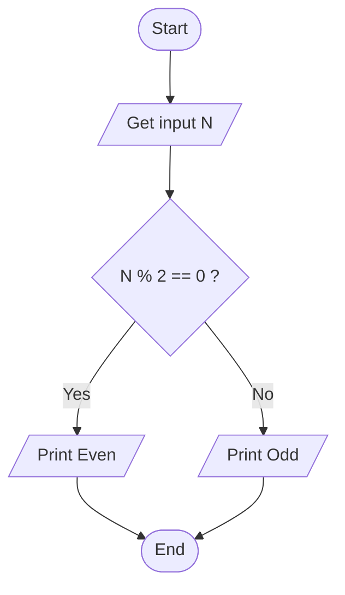
---

## 2. Calculate Total and Average Marks
### ✔ Pseudocode
```text
START
    INPUT Mark1, Mark2, Mark3
    Total = Mark1 + Mark2 + Mark3
    Average = Total / 3
    PRINT Total
    PRINT Average
END
```
### ✔ Flowchart
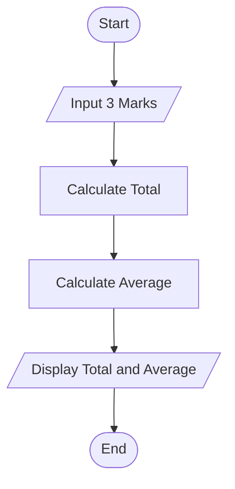
---

## 3. Display Multiplication Table
### ✔ Pseudocode
```text
START
    INPUT Number
    FOR I = 1 TO 10
        PRINT Number * I
    NEXT I
END
```
### ✔ Flowchart
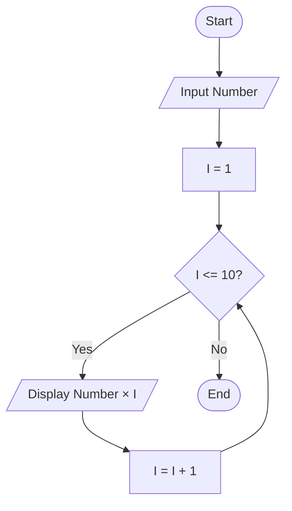
---

## 4. Positive, Negative, or Zero Check
### ✔ Pseudocode
```text
START
    INPUT Number
    IF Number > 0 THEN
        PRINT "Positive"
    ELSE IF Number < 0 THEN
        PRINT "Negative"
    ELSE
        PRINT "Zero"
    ENDIF
END
```
### ✔ Flowchart
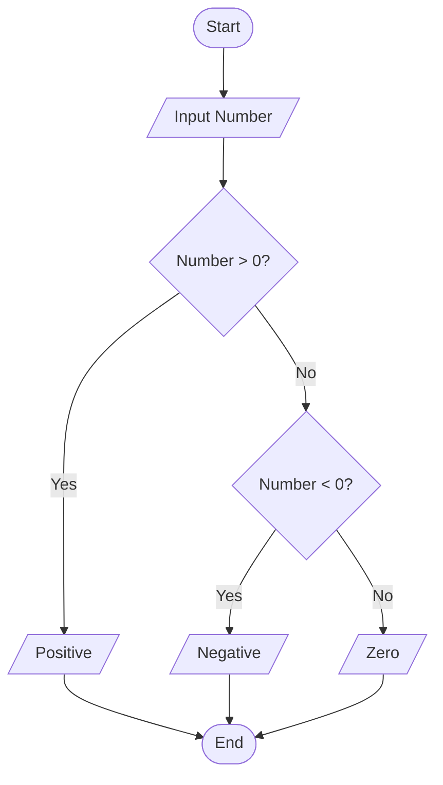
---

## 5. Simple Interest Calculator
### ✔ Pseudocode
```text
START
    INPUT P, R, T
    SI = (P * R * T) / 100
    PRINT SI
END
```
### ✔ Flowchart
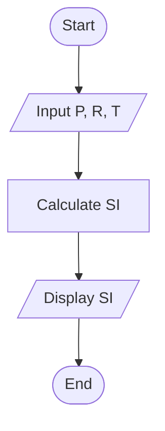
---

## 6. Average Temperature Calculation
### ✔ Pseudocode
```text
START
    Total = 0
    FOR Day = 1 TO 7
        INPUT Temp
        Total = Total + Temp
    NEXT Day
    Average = Total / 7
    PRINT Average
END
```
### ✔ Flowchart
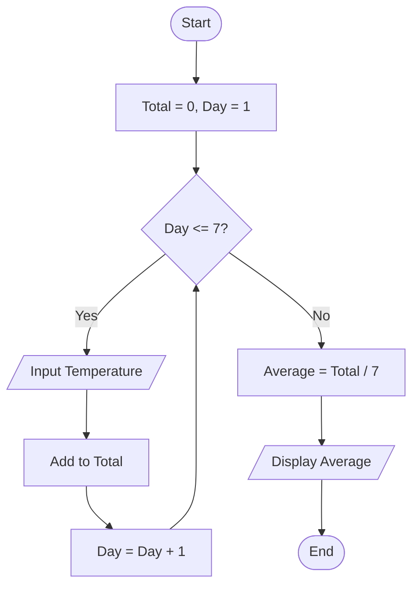
---

## 7. Calculate Area of a Rectangle
### ✔ Pseudocode
```text
START
    INPUT Length, Width
    Area = Length * Width
    PRINT Area
END
```
### ✔ Flowchart
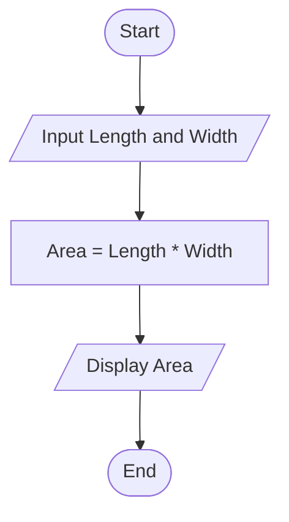
---

## 8. Determine Pass or Fail
### ✔ Pseudocode
```text
START
    INPUT Average
    IF Average >= 50 THEN
        PRINT "Pass"
    ELSE
        PRINT "Fail"
    ENDIF
END
```
### ✔ Flowchart
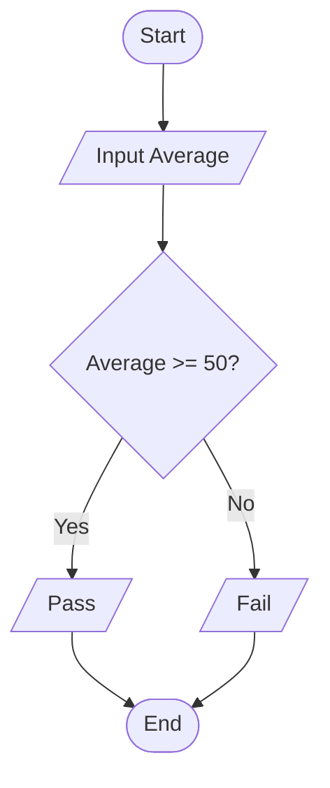
---

## 9. Calculate Factorial of a Number
### ✔ Pseudocode
```text
START
    INPUT N
    Factorial = 1
    FOR I = 1 TO N
        Factorial = Factorial * I
    NEXT I
    PRINT Factorial
END
```
### ✔ Flowchart
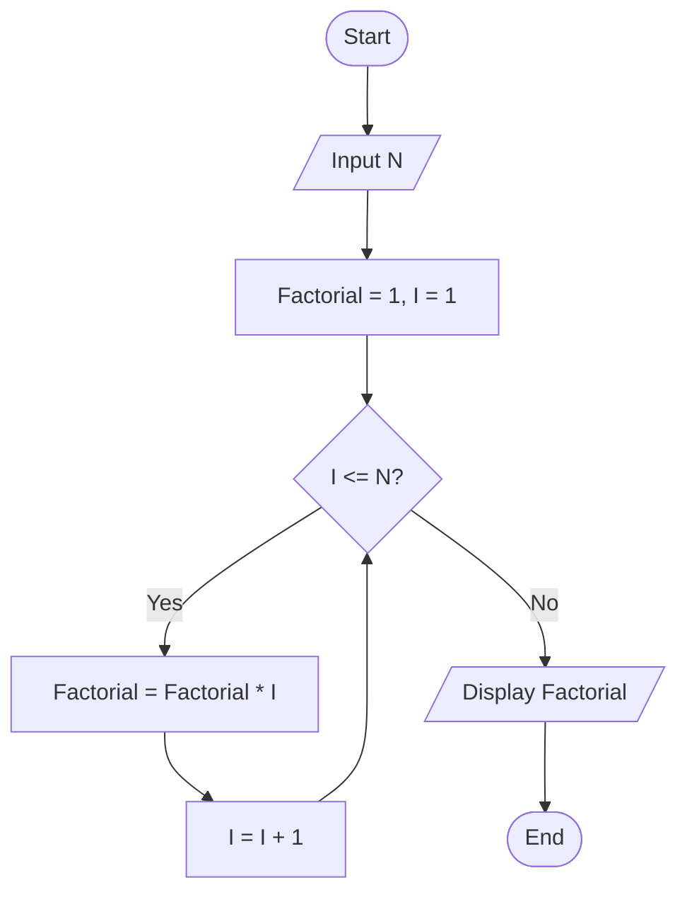
---

## 10. Calculate Discount on Purchase
### ✔ Pseudocode
```text
START
    INPUT Amount
    IF Amount > 1000 THEN
        Discount = Amount * 0.10
    ELSE
        Discount = 0
    ENDIF
    Final = Amount - Discount
    PRINT Final
END
```
### ✔ Flowchart
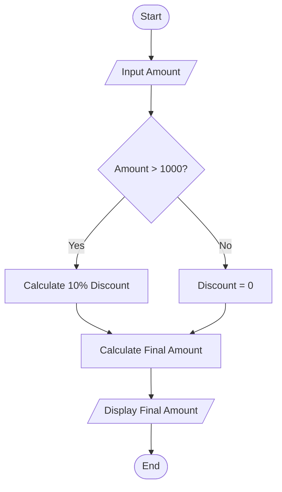
---

## 11. Online Shopping Delivery Eligibility

### ✔ Pseudocode

```text
START

    INPUT PurchaseAmount

    IF PurchaseAmount >= 500 THEN
        PRINT "Free Delivery"
    ELSE
        PRINT "Delivery Charge Applies"
    ENDIF

END
```

### ✔ Flowchart

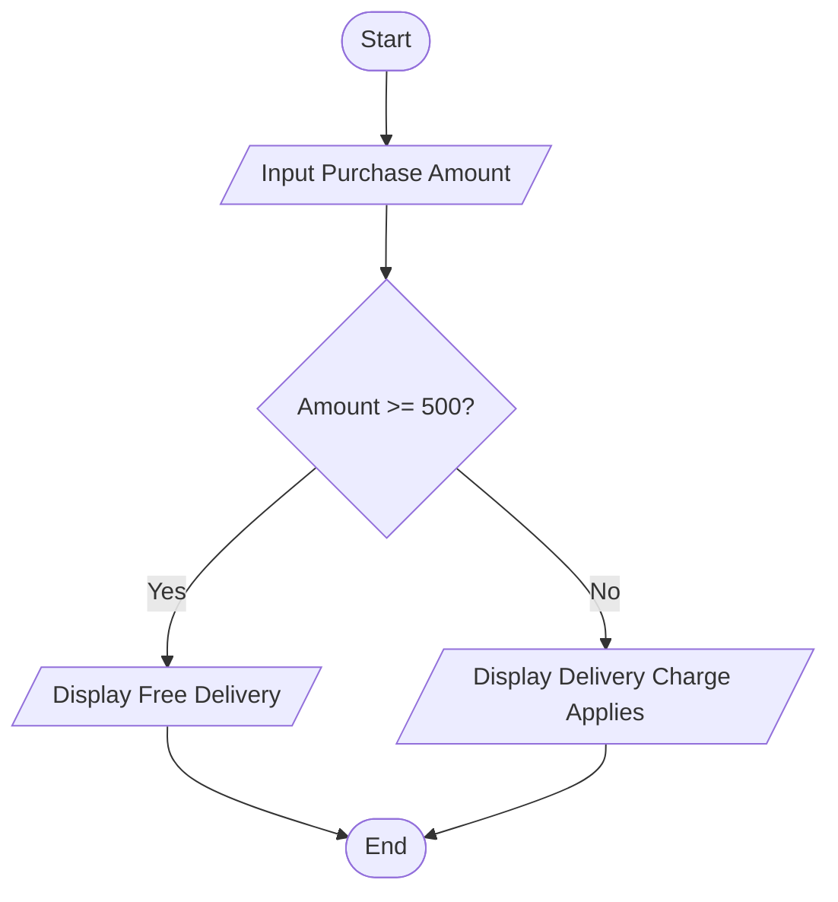

---

## 12. Employee Salary and Bonus Calculator

### ✔ Pseudocode

```text
START

    INPUT Salary
    INPUT YearsOfService

    IF YearsOfService >= 5 THEN
        Bonus = Salary * 0.10
    ELSE
        Bonus = Salary * 0.05
    ENDIF

    TotalSalary = Salary + Bonus

    PRINT Bonus
    PRINT TotalSalary

END
```

### ✔ Flowchart

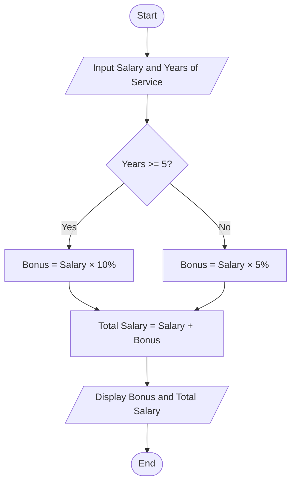

---

## 13. Mobile Data Usage Monitor

### ✔ Pseudocode

```text
START

    INPUT DataLimit
    INPUT DataUsed

    IF DataUsed > DataLimit THEN
        Extra = DataUsed - DataLimit
        PRINT "Data Limit Exceeded"
        PRINT Extra
    ELSE
        Remaining = DataLimit - DataUsed
        PRINT "Data Remaining"
        PRINT Remaining
    ENDIF

END
```

### ✔ Flowchart

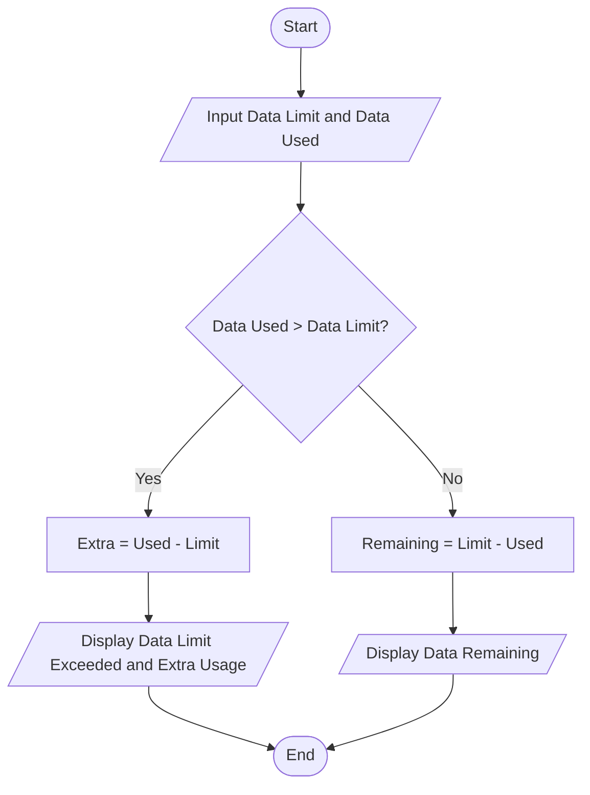

---

## 14. Login System (Maximum 3 Attempts)

### ✔ Pseudocode

```text
START

    Password = "admin123"
    Attempts = 0

    WHILE Attempts < 3

        INPUT UserPassword

        IF UserPassword = Password THEN
            PRINT "Access Granted"
            STOP
        ENDIF

        Attempts = Attempts + 1

    ENDWHILE

    PRINT "Account Locked"

END
```

### ✔ Flowchart

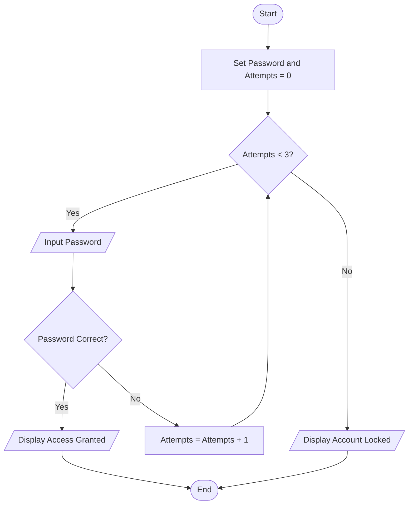

---

## 15. Store Checkout with Multiple Items

### ✔ Pseudocode

```text
START

    INPUT NumberOfItems

    Total = 0
    Counter = 1

    WHILE Counter <= NumberOfItems

        INPUT Price
        Total = Total + Price

        Counter = Counter + 1

    ENDWHILE

    IF Total > 5000 THEN
        Discount = Total * 0.15
    ELSE
        Discount = 0
    ENDIF

    FinalAmount = Total - Discount

    PRINT Total
    PRINT Discount
    PRINT FinalAmount

END
```

### ✔ Flowchart

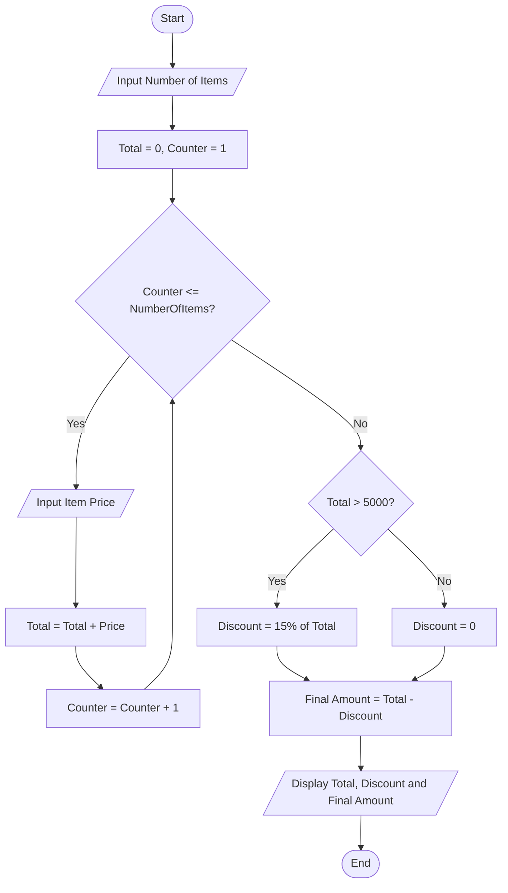

---

## 16. Electricity Bill Calculator

### ✔ Pseudocode

```text
START

    INPUT Units

    IF Units <= 100 THEN
        Bill = Units * 1.5

    ELSE IF Units <= 300 THEN
        Bill = (100 * 1.5) +
               ((Units - 100) * 2.0)

    ELSE
        Bill = (100 * 1.5) +
               (200 * 2.0) +
               ((Units - 300) * 3.0)
    ENDIF

    PRINT Bill

END
```

### ✔ Flowchart

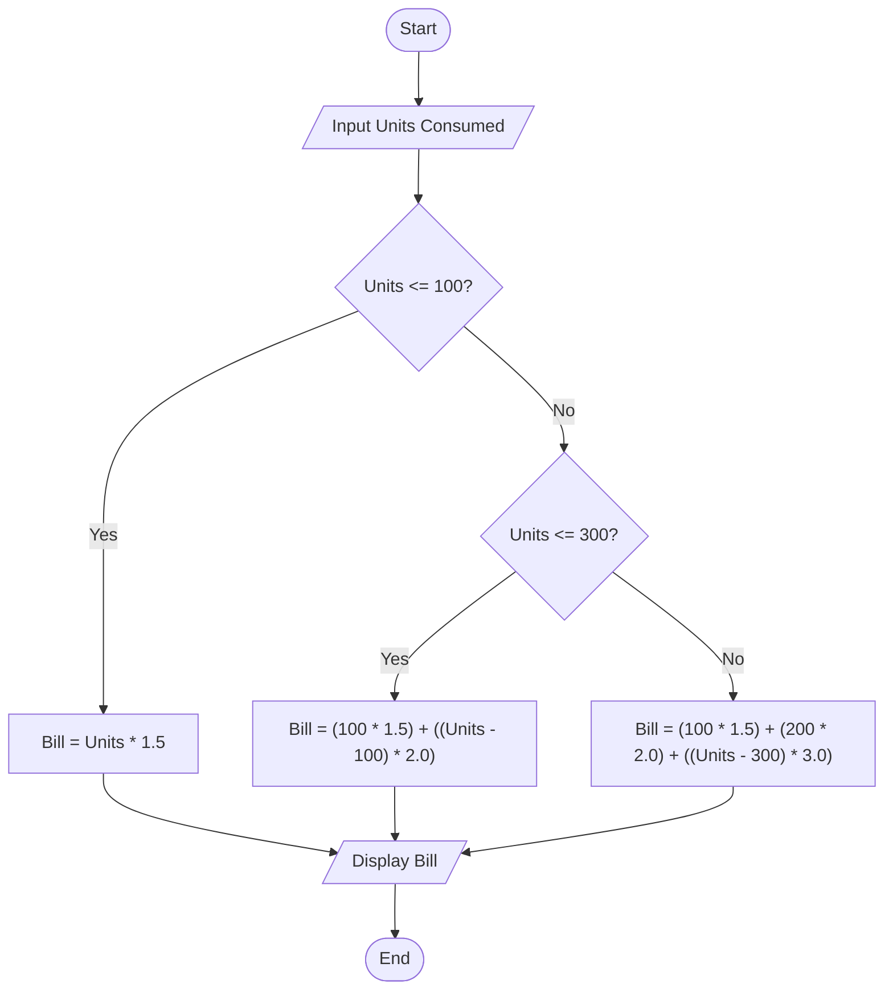
