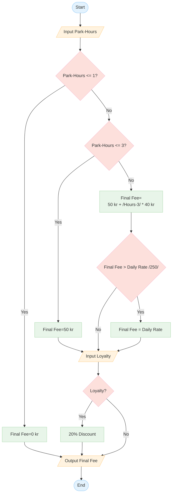

```mermaid
flowchart TD
    A([Start]):::term-->
    B[/Input Park-Hours/]:::io

    B --> C{Park-Hours <= 1?}:::dec
    C -- Yes --> D[Final Fee=0 kr]:::proc
    D-->Out
   

    C -- No --> G{Park-Hours <= 3?}:::dec
    G -- Yes --> H[Final Fee=50 kr]:::proc
    H-->LC

    G -- No --> J[Final Fee=
    50 kr + /Hours-3/ * 40 kr]:::proc
    J--> K{Final Fee > Daily Rate /250/}:::dec
    K -- No --> LC
    
    K -- Yes --> L[Final Fee = Daily Rate]:::proc  
    L --> LC[/Input Loyalty/]:::io
    LC --> M{Loyalty?}:::dec
    M-- Yes --> N[20% Discount]:::proc  

     N --> Out[/Output Final Fee/]:::io
     M -- No --> Out
     Out --> End

 
    End([End]):::term 
  
  classDef term fill:#e3f2fd,stroke:#90caf9,color:#333,stroke-width:1px;
  classDef io fill:#fff3e0,stroke:#ffcc80,color:#333,stroke-width:1px;
  classDef proc fill:#e8f5e9,stroke:#a5d6a7,color:#333,stroke-width:1px;
  classDef dec fill:#fde0dc,stroke:#f8bbd0,color:#333,stroke-width:1px;
  classDef pre fill:#ede7f6,stroke:#b39ddb,color:#333,stroke-width:1px;
  classDef conn fill:#f5f5f5,stroke:#bdbdbd,color:#333,stroke-width:1px;
  classDef hide fill:none,stroke:none,color:none;
  classDef label fill:none,stroke:none,color:#333,text-align:center;
```